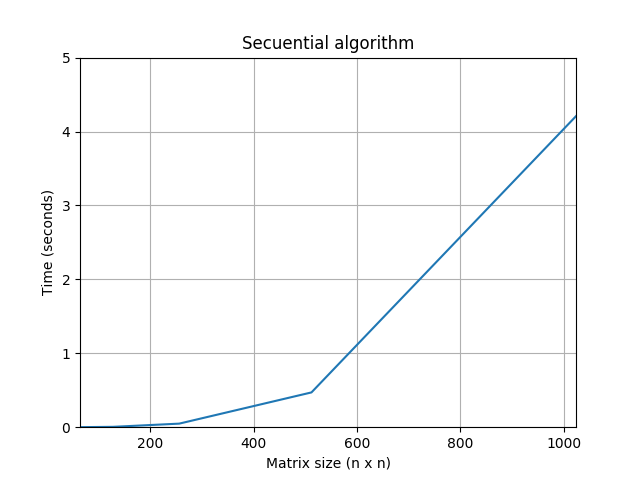
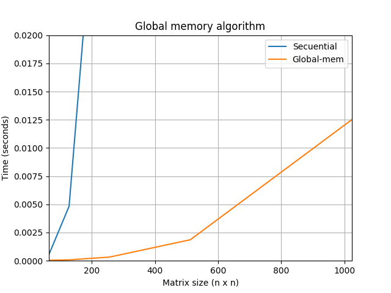
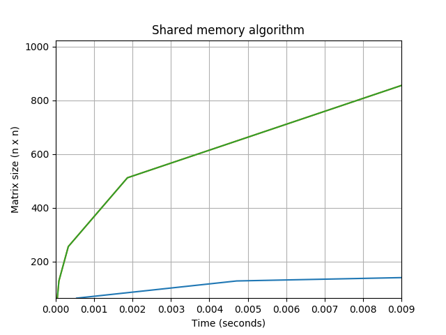

## Aceleración del algoritmo para multiplicar dos matrices cuadradas

**Algoritmo secuencial**
<style>
  .col2 {
    columns: 2 200px;         /* number of columns and width in pixels*/
    -webkit-columns: 2 200px; /* chrome, safari */
    -moz-columns: 2 200px;    /* firefox */
  }
<div class="col2">
```void sec_matMult(int* A, int* B, int* C, int size){
    for (int i = 0; i < size; i++) {
      for (int j = 0; j < size; j++) {
        int sum = 0;
        for (int k = 0; k < size; k++) {
          sum += A[j * size + k] * B[k * size + i];
        }
        C[j * size + i] = sum;
      }
    }
  }
```
  
</div>
</style>

**Usando memoria global**
```
__global__ void gbmem_matMult(int* m1, int* m2, int* ansG, int n){
	int k, sum = 0;
	int i = blockIdx.x * blockDim.x + threadIdx.x; 
  int j = blockIdx.y * blockDim.y + threadIdx.y;
  if (i < n && j < n) {
    for (k = 0; k < n; k++) {
      sum += m1[j * n + k] * m2[k * n + i];
    }
    ansG[j * n + i] = sum;
  }
}
```


**Utilizando memoria compartida y global**

```
__global__ void sdmem_matMult(int* m1, int* m2, int* ansS, int n){

  __shared__ int m1_s[tile][tile];
  __shared__ int m2_s[tile][tile];

  int bx = blockIdx.x; int by = blockIdx.y;
  int tx = threadIdx.x; int ty = threadIdx.y;

  int row = by * tile + ty;
  int col = bx * tile + tx;

	int sum = 0;
	for(int m = 0; m < n/tile; ++m){
    m1_s[ty][tx] = m1[row * n + m * tile + tx];
    m2_s[ty][tx] = m2[(m * tile + ty) * n + col];
    __syncthreads();

    for (int k = 0; k < tile; ++k) {
      sum += m1_s[ty][k] * m2_s[k][tx];
    }
    __syncthreads();
  }
  ansS[row * n + col] = sum;
}
```


