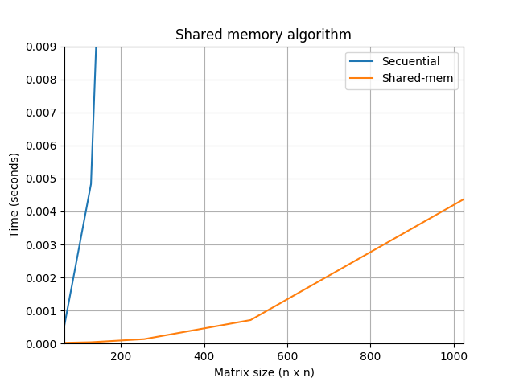

## Aceleración del algoritmo para multiplicar dos matrices cuadradas

**Algoritmo secuencial**
```{r, fig.width=6, fig.height=2.5}
dygraph(nhtemp, main = "New Haven Temperatures", ylab = "Temp (F)") 
```
**Secuencial (sin aceleración)**


**Usando memoria global**


**Utilizando memoria compartida y global**


